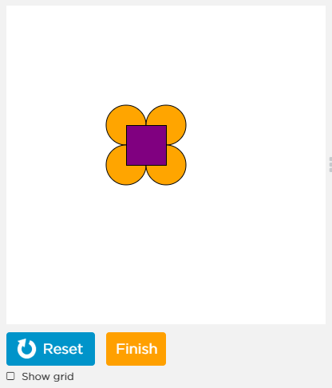

# Overview

This lesson is an introduction to GameLab, Code.Org's online JavaScript IDE. You'll learn the coordinate system and the first component of algoritms: ordering instructions.

<!-- Don't edit links here, change them in _data/assignment.yml instead, -->

[lesson]: <{{site.data.assignment.lesson}}>     
[slides]:   <{{site.data.assignment.slides}}>   
[template]: <{{site.data.assignment.template}}> 
